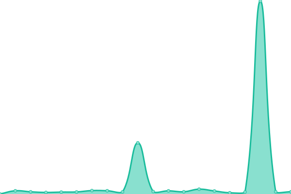

# [📈 Live Status](https://brettinternet.com): <!--live status--> **🟧 Partial outage**

This repository contains the open-source uptime monitor and status page for [Brett](https://brettinternet.com), powered by [Upptime](https://github.com/upptime/upptime).

With [Upptime](https://upptime.js.org), you can get your own unlimited and free uptime monitor and status page, powered entirely by a GitHub repository. We use [Issues](https://github.com/brettinternet/status/issues) as incident reports, [Actions](https://github.com/brettinternet/status/actions) as uptime monitors, and [Pages](https://brettinternet.com) for the status page.

<!--start: status pages-->
<!-- This summary is generated by Upptime (https://github.com/upptime/upptime) -->
<!-- Do not edit this manually, your changes will be overwritten -->
<!-- prettier-ignore -->
| URL | Status | History | Response Time | Uptime |
| --- | ------ | ------- | ------------- | ------ |
|  [Blog](https://brettinternet.com) | 🟩 Up | [blog.yml](https://github.com/brettinternet/status/commits/HEAD/history/blog.yml) | 

 130ms
     
 | 

<a href="https://status.brettinternet.com/history/blog">100.00%</a>
    

|  [Plex](https://plex.brettgardiner.net) | 🟩 Up | [plex.yml](https://github.com/brettinternet/status/commits/HEAD/history/plex.yml) | 

 1094ms
     
 | 

<a href="https://status.brettinternet.com/history/plex">100.00%</a>
    

|  [Bookmarks](https://bookmarks.brettgardiner.net/u:brett) | 🟩 Up | [bookmarks.yml](https://github.com/brettinternet/status/commits/HEAD/history/bookmarks.yml) | 

 407ms
     
 | 

<a href="https://status.brettinternet.com/history/bookmarks">100.00%</a>
    

|  Recipes | 🟥 Down | [recipes.yml](https://github.com/brettinternet/status/commits/HEAD/history/recipes.yml) | 

 315ms
     
 | 

<a href="https://status.brettinternet.com/history/recipes">100.00%</a>
    

<!--end: status pages-->

[**Visit our status website →**](https://brettinternet.com)

## 📄 License

- Powered by: [Upptime](https://github.com/upptime/upptime)
- Code: [MIT](./LICENSE) © [Brett](https://brettinternet.com)
- Data in the `./history` directory: [Open Database License](https://opendatacommons.org/licenses/odbl/1-0/)
